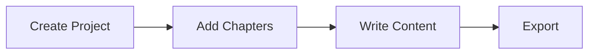

# User Documentation Plan

> **MkDocs + Material Theme** - Comprehensive documentation strategy for Kalahari

**Status:** 📝 Planning
**Implementation:** Phase 1+ (parallel with development)
**Version:** 1.0
**Last Updated:** 2025-10-25

---

## Overview

This document outlines the **user documentation strategy** for Kalahari, covering structure, tooling, content types, and phased delivery aligned with development roadmap.

### Goals

1. **Comprehensive** - Cover all features for writers of all skill levels
2. **Accessible** - Clear, searchable, multi-language support
3. **Up-to-date** - Documentation parallel with implementation
4. **Professional** - High-quality technical writing and visuals
5. **Community-friendly** - Enable community contributions

### Audience

- **End Users** - Writers using Kalahari (primary audience)
- **Plugin Developers** - Developers creating plugins (secondary)
- **Contributors** - Open source contributors (tertiary)

---

## Documentation Stack

### Core Technology: MkDocs + Material Theme

**MkDocs** - Static site generator for project documentation
- Simple Markdown-based content
- Fast build times
- Git-friendly (version control)
- Python-based (pip install mkdocs)

**Material for MkDocs** - Modern documentation theme
- Responsive design (mobile-friendly)
- Dark/light mode
- Search (instant, client-side)
- Navigation: tabs, sections, expand/collapse
- Internationalization (i18n) built-in
- Code highlighting (C++, Python, JSON)
- Admonitions (tips, warnings, notes)
- Diagrams (Mermaid support)

**Why MkDocs + Material?**
- ✅ Best-in-class documentation experience
- ✅ Zero backend (static HTML)
- ✅ Fast, SEO-friendly
- ✅ Multi-language support (EN + PL from start)
- ✅ Easy contributor workflow (Markdown)
- ✅ Version switching (docs for v1.0, v1.1, etc.)
- ✅ Free hosting (GitHub Pages, Netlify)

### Tech Stack

```yaml
# Requirements
- mkdocs >= 1.5
- mkdocs-material >= 9.4
- pymdown-extensions (enhanced Markdown)
- mkdocs-static-i18n (multi-language)

# Build
mkdocs build  # → site/ directory (static HTML)

# Dev server
mkdocs serve  # → http://localhost:8000 (live reload)

# Deploy
mkdocs gh-deploy  # → GitHub Pages
```

---

## Documentation Structure

### Directory Layout

```
docs/                       # MkDocs source
├── index.md               # Homepage (overview, quick start)
├── getting-started/       # Installation, first project
│   ├── installation.md    # Windows/macOS/Linux installation
│   ├── first-project.md   # Create your first book project
│   └── interface-tour.md  # GUI overview
├── user-guide/            # Main user documentation
│   ├── editor/            # Rich text editing
│   │   ├── formatting.md
│   │   ├── styles.md
│   │   └── shortcuts.md
│   ├── project/           # Project management
│   │   ├── chapters.md
│   │   ├── parts.md
│   │   └── metadata.md
│   ├── panels/            # Dockable panels
│   │   ├── navigator.md
│   │   ├── preview.md
│   │   ├── assistant.md
│   │   └── statistics.md
│   ├── export/            # Export formats
│   │   ├── docx.md
│   │   ├── pdf.md
│   │   └── markdown.md
│   ├── customization/     # Toolbars, shortcuts, themes
│   │   ├── toolbars.md    # Customizable toolbars
│   │   ├── perspectives.md
│   │   ├── shortcuts.md
│   │   └── themes.md
│   └── features/          # Advanced features
│       ├── character-bank.md
│       ├── location-bank.md
│       ├── notes.md
│       └── calendar.md
├── plugins/               # Plugin ecosystem
│   ├── overview.md        # What are plugins?
│   ├── installing.md      # Installing .kplugin files
│   ├── free-plugins.md    # Free plugin catalog
│   ├── premium-plugins.md # Premium plugin catalog
│   └── creating.md        # Plugin development intro
├── reference/             # Technical reference
│   ├── file-formats.md    # .klh file format spec
│   ├── keyboard-shortcuts.md  # Complete shortcut list
│   └── menu-reference.md  # All menu items documented
├── troubleshooting/       # Common issues
│   ├── faq.md
│   ├── performance.md
│   └── known-issues.md
└── about/                 # Meta information
    ├── changelog.md       # Version history (link to CHANGELOG.md)
    ├── roadmap.md         # Future plans (link to ROADMAP.md)
    ├── license.md         # MIT License
    └── contributing.md    # Contribution guide

mkdocs.yml                 # MkDocs configuration
```

---

## Content Types

### 1. Tutorials (Learning-Oriented)

**Goal:** Guide users through learning by doing

**Examples:**
- "Your First Book Project" - Step-by-step first use
- "Creating a Novel" - Genre-specific workflow
- "Using the Graphical Assistant" - Feature introduction

**Format:**
- Clear numbered steps
- Screenshots at each step
- Expected results shown
- "What you learned" summary

### 2. How-To Guides (Task-Oriented)

**Goal:** Help users accomplish specific tasks

**Examples:**
- "How to Export to DOCX with Formatting"
- "How to Customize Your Toolbar"
- "How to Set Up Auto-Save"

**Format:**
- Problem statement
- Prerequisites
- Step-by-step solution
- Troubleshooting tips

### 3. Reference (Information-Oriented)

**Goal:** Provide accurate technical information

**Examples:**
- Complete keyboard shortcuts list
- Menu reference (all commands)
- .klh file format specification
- Plugin API reference

**Format:**
- Tables, lists, diagrams
- Precise, technical language
- Searchable structure
- No explanations (just facts)

### 4. Explanations (Understanding-Oriented)

**Goal:** Deepen conceptual understanding

**Examples:**
- "Understanding Kalahari's Plugin Architecture"
- "How Customizable Toolbars Work"
- "The Command Registry System"

**Format:**
- Background and context
- Diagrams and visuals
- Connections to other concepts
- "Why it matters" sections

---

## Phased Delivery

### Phase 0: Foundation (Weeks 1-8)

**Documentation:** Setup only, no user docs yet

**Deliverables:**
- docs/ directory created
- mkdocs.yml configured
- Material theme installed
- Placeholder structure (empty .md files)

**Rationale:** Infrastructure only, no features to document yet

---

### Phase 1: Core Editor (Weeks 9-20)

**Documentation:** Getting Started + Basic User Guide

**Content to create:**
- Installation guide (Windows, macOS, Linux)
- First project tutorial
- Interface tour
- Editor basics (formatting, styles)
- Project management (chapters, save/load)
- Keyboard shortcuts reference

**Target:** 20-30 pages (EN only for now)

**Timeline:** Document parallel with implementation
- Start docs when feature coding begins
- Screenshots from development builds
- Update as features stabilize

---

### Phase 2: Plugin System MVP (Weeks 21-30)

**Documentation:** Plugin Guide + 4 Plugin Docs

**Content to create:**
- Plugin overview (what are plugins?)
- Installing plugins (.kplugin drag & drop)
- DOCX Exporter plugin guide
- Markdown Tools plugin guide
- Basic Statistics plugin guide
- Assistant Lion plugin guide

**Target:** +15 pages

**Add:** Plugin developer quickstart (for community)

---

### Phase 3: Feature Plugins (Weeks 31-44)

**Documentation:** Advanced Features + Premium Plugins

**Content to create:**
- Character Bank guide
- Location Bank guide
- Notes system guide
- Writer's Calendar guide
- Premium plugins documentation:
  - AI Assistant Pro
  - Advanced Analytics
- Customization guides (toolbars, perspectives, themes)

**Target:** +25 pages

**Add:** Polish translation (EN + PL complete)

---

### Phase 4: Advanced Plugins (Weeks 45-56)

**Documentation:** Professional Features

**Content to create:**
- Export Suite guide (EPUB, advanced PDF)
- Research Pro guide (OCR, citations)
- Collaboration Pack guide
- Troubleshooting section
- FAQ from beta testing

**Target:** +20 pages

**Add:** Video tutorials (5-10 screencasts)

---

### Phase 5: Polish & Release (Weeks 57-68)

**Documentation:** Complete, Professional, Multi-Language

**Tasks:**
- Review all docs for accuracy
- Beta tester feedback integration
- Polish (PL) translation complete
- Add more screenshots (polished UI)
- Create 10+ video tutorials
- SEO optimization
- Deploy to kalahari.app/docs

**Target:** 100-120 pages (EN + PL)

**Deliverables:**
- Complete user manual
- Plugin developer guide
- Video tutorial library
- FAQ (50+ questions)
- Multi-language (EN + PL)

---

## Multi-Language Strategy

### Language Priority

1. **English** - PRIMARY (always 100% complete)
2. **Polish** - SECONDARY (complete by Phase 5)
3. **German, Russian, French, Spanish** - Post-1.0

### Implementation: mkdocs-static-i18n

**Configuration:**
```yaml
# mkdocs.yml
plugins:
  - i18n:
      default_language: en
      languages:
        en:
          name: English
          build: true
        pl:
          name: Polski
          build: true
```

**File structure:**
```
docs/
├── index.md              # English (default)
├── index.pl.md           # Polish translation
├── getting-started/
│   ├── installation.md
│   └── installation.pl.md
```

**Workflow:**
1. Write English first
2. Polish translation follows (within 1 week)
3. Community can contribute other languages

---

## Visual Assets

### Screenshots

**Requirements:**
- High resolution (2x for Retina displays)
- Consistent UI theme (Light mode default)
- Annotated (arrows, highlights) where helpful
- Compressed (WebP format for web)

**Tools:**
- Greenshot (Windows)
- Skitch (macOS)
- Flameshot (Linux)

**Naming:** `screenshot-{feature}-{variant}.png`
Example: `screenshot-toolbar-customization-1.png`

### Diagrams

**Types:**
- Architecture diagrams (system overview)
- Workflow diagrams (user tasks)
- UI layouts (panel arrangements)

**Tools:**
- **Mermaid** (embedded in Markdown)
- **Draw.io** (for complex diagrams, export SVG)

**Example Mermaid:**


### Videos

**Screencasts:**
- Short (3-5 minutes)
- Focus on single task
- Professional narration (EN + PL)
- 1080p minimum

**Tools:**
- OBS Studio (recording)
- DaVinci Resolve (editing)
- YouTube (hosting)

**Topics (10 planned):**
1. Installing Kalahari
2. Your First Book Project
3. Customizing Toolbars
4. Using the Graphical Assistant
5. Exporting to DOCX/PDF
6. Character & Location Banks
7. Installing Plugins
8. Writing with AI Assistant Pro
9. Advanced Analytics Overview
10. Collaborative Writing with Beta Readers

---

## Search & Navigation

### Search Features

Material theme provides:
- **Instant search** - No backend needed
- **Fuzzy matching** - Typo-tolerant
- **Result highlighting** - Shows context
- **Multi-language** - Searches in selected language

**Optimization:**
- Use descriptive headings (searchable)
- Include synonyms in content
- Tag important terms

### Navigation

**Top-level tabs:**
- Getting Started
- User Guide
- Plugins
- Reference
- Troubleshooting

**Sidebar:** Auto-generated from directory structure

**Footer:** Previous/Next page navigation

**Breadcrumbs:** Show current location

---

## Maintenance & Updates

### Documentation Lifecycle

**When to update docs:**
- ✅ New feature added → Write docs before release
- ✅ UI change → Update screenshots
- ✅ Bug fix affecting workflow → Update guide
- ✅ New plugin released → Add plugin docs
- ✅ User feedback → Improve clarity

**Review cycle:**
- **Monthly:** Check for outdated content
- **Per release:** Full review before version bump
- **Community PRs:** Review within 1 week

### Versioning

**Docs versions match software versions:**
- v1.0 docs (stable)
- v1.1 docs (next release)
- dev docs (bleeding edge)

**Material theme supports version switcher:**
```yaml
extra:
  version:
    provider: mike  # Version management tool
```

---

## Hosting & Deployment

### Primary: GitHub Pages

**Setup:**
```bash
mkdocs gh-deploy  # Builds + pushes to gh-pages branch
```

**URL:** https://kalahari-app.github.io/kalahari/

**Benefits:**
- Free hosting
- Automatic HTTPS
- Git-based workflow
- CI/CD friendly

### Alternative: Custom Domain

**Production URL:** https://docs.kalahari.app

**Setup:**
- Point DNS CNAME to GitHub Pages
- Configure in GitHub repo settings
- Material theme automatically adapts

### CI/CD: GitHub Actions

**Workflow:** `.github/workflows/docs.yml`

```yaml
name: Deploy Documentation
on:
  push:
    branches: [master]
    paths: ['docs/**', 'mkdocs.yml']
jobs:
  deploy:
    runs-on: ubuntu-latest
    steps:
      - uses: actions/checkout@v3
      - uses: actions/setup-python@v4
      - run: pip install mkdocs-material
      - run: mkdocs gh-deploy --force
```

**Result:** Docs auto-deploy on every commit to master

---

## Community Contributions

### Contributing Guide

**How contributors can help:**
- Fix typos/grammar
- Add missing information
- Translate to other languages
- Create tutorials
- Record screencasts

**Workflow:**
1. Fork repo
2. Edit Markdown in docs/
3. Test locally: `mkdocs serve`
4. Create Pull Request
5. Core team reviews + merges

**Guidelines:**
- Follow existing structure
- Use clear, simple language
- Include screenshots where helpful
- Test all steps before submitting

---

## Success Metrics

### Quantitative

**Traffic:**
- Page views per month
- Most visited pages
- Search queries (what users look for)

**Engagement:**
- Average time on page
- Bounce rate
- Pages per session

**Community:**
- Documentation PRs submitted
- Translation contributions

### Qualitative

**User feedback:**
- Survey: "How helpful was this documentation?" (1-5 stars)
- Comment system (GitHub Discussions)
- Support ticket reduction (well-documented = fewer questions)

**Beta tester feedback:**
- "Were you able to find what you needed?"
- "What's missing from the docs?"

---

## Integration with Project

### Cross-References

**From docs to codebase:**
- Link to GitHub issues (bug reports)
- Link to source code (for developers)
- Link to CHANGELOG.md (version history)

**From codebase to docs:**
- In-app Help → Opens docs in browser
- F1 key → Context-sensitive help
- Plugin README → Links to plugin docs

### In-App Help

**Phase 3+ feature:**
- Help menu → "User Manual" → Opens docs
- Context help (F1) → Opens relevant page
- Tooltips reference keyboard shortcuts
- Assistant can suggest docs links

---

## Timeline Summary

| Phase | Weeks | Documentation Deliverable | Pages | Languages |
|-------|-------|---------------------------|-------|-----------|
| 0 | 1-8 | Setup only | 0 | - |
| 1 | 9-20 | Getting Started + Basics | 20-30 | EN |
| 2 | 21-30 | Plugin guides | +15 | EN |
| 3 | 31-44 | Advanced features | +25 | EN + PL |
| 4 | 45-56 | Professional features | +20 | EN + PL |
| 5 | 57-68 | Complete + videos | 100-120 | EN + PL |
| Post-1.0 | - | Community translations | - | +4 languages |

---

## Budget (Optional)

**Costs:**
- MkDocs + Material: **FREE** (open source)
- GitHub Pages hosting: **FREE**
- Custom domain (docs.kalahari.app): **~$15/year**
- Video hosting (YouTube): **FREE**
- Professional narration: **~$500** (optional, can DIY)
- Translation (professional): **~$0.10/word** (or community-contributed)

**Total:** $0-1000 (depending on professional help)

---

## Next Steps

**Immediate (Pre-Phase 0):**
- [ ] Create docs/ directory structure
- [ ] Configure mkdocs.yml
- [ ] Install Material theme
- [ ] Create placeholder index.md

**Phase 1 (Parallel with development):**
- [ ] Write installation guide
- [ ] Document first implemented features
- [ ] Take initial screenshots
- [ ] Set up GitHub Pages deployment

**Phase 2+:**
- [ ] Expand content as features are added
- [ ] Add Polish translations
- [ ] Create video tutorials
- [ ] Gather beta tester feedback

---

## References

- **MkDocs:** https://www.mkdocs.org/
- **Material for MkDocs:** https://squidfunk.github.io/mkdocs-material/
- **Keep a Changelog:** https://keepachangelog.com/ (for changelog page)
- **Diátaxis Framework:** https://diataxis.fr/ (documentation philosophy)

---

**Document Version:** 1.0
**Last Updated:** 2025-10-25
**Next Review:** Start of Phase 1
